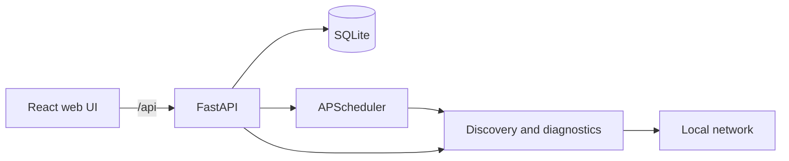

# netscantools

**A local-first control panel for discovering, understanding, and organizing your LAN.**

[](https://github.com/erop39/netscantools/releases/tag/v0.9.0-beta.2)


netscantools (eG::39 / netPad) brings network discovery, device identity, manual inventory, security hygiene, presence tracking, and address planning into one private web interface. It is designed for home labs and small local networks, with SQLite storage and no required cloud service.

> [!NOTE]
> This project is currently in public beta. The tested launch path is Windows with Python 3.12+ and Node.js.

## What it does

| Area | Capabilities |
|---|---|
| **Discovery** | Quick and full subnet scans, online/offline state, hostname and OUI vendor resolution, latency history, TCP port probing |
| **Device operations** | Ping, Wake-on-LAN, DNS refresh, SMB share enumeration, TLS certificate checks, local/external web UI links and QR codes |
| **Inventory** | Manual assets, linked network devices, structured identity, serials, notes, purchase dates, and one ordered location catalog |
| **Presence** | Mark personal devices and see who is currently home from the dashboard |
| **Hygiene** | Network and device scores, exposed-service risks, security checklist, and a readable event timeline |
| **Planner** | Planned IP slots, MAC bindings, service ports, live-vs-planned state, inventory import, and JSON import/export |
| **Automation** | Scheduled scans, device-change notifications, scheduled SQLite backups, and configurable scan profiles |

## Quick start

### Requirements

- Windows
- Python 3.12 or newer
- Node.js with npm
- Access to the local network you want to scan

### Start everything

```powershell
git clone https://github.com/erop39/netscantools.git
cd netscantools
.\start.bat
```

You can also launch directly:

```powershell
python run.py
```

The launcher creates the backend virtual environment, installs missing backend and frontend dependencies, starts both development servers, and opens the browser.

| Service | Address |
|---|---|
| Web UI | <http://127.0.0.1:5173> |
| API | <http://127.0.0.1:8000> |
| Interactive API docs | <http://127.0.0.1:8000/docs> |
| Health check | <http://127.0.0.1:8000/api/health> |

Initial local login:

```text
Username: admin
Password: admin
```

> [!WARNING]
> Change the default password immediately from the account screen. Before exposing the app beyond your own machine, also replace `JWT_SECRET` and review the security notes below.

### Launcher controls

| Command | Purpose |
|---|---|
| `.\start.bat` | Start API and UI; install dependencies when needed |
| `.\restart.bat` | Stop and restart using `--skip-install` |
| `.\stop.bat` | Stop listeners on the configured default ports |
| `Ctrl+C` | Gracefully stop both processes in the launcher window |

Useful options:

```powershell
python run.py --no-browser
python run.py --api-port 8001 --ui-port 5174
python run.py --skip-install
```

If a requested port is already busy, the launcher selects the next available port and prints the resulting URL.

## First-run setup

1. Sign in and change the default password.
2. Open **Settings** and set your network in CIDR notation, for example `192.168.1.0/24`.
3. Choose the quick/full scan port sets and, if wanted, a scan interval.
4. Run a scan from **Scans**.
5. Add names, icons, locations, ownership flags, and notes as devices are identified.

The initial scan subnet is `192.168.1.0/24`. Automatic scanning is disabled until a non-zero interval is configured.

## Configuration

Backend process settings are loaded from `backend/.env`. Start from the supplied template:

```powershell
Copy-Item backend\.env.example backend\.env
```

| Variable | Default | Purpose |
|---|---|---|
| `ADMIN_USER` | `admin` | Initial administrator username |
| `ADMIN_PASSWORD` | `admin` | Initial administrator password |
| `JWT_SECRET` | development value | Signs login tokens; replace with a long random value |
| `JWT_EXPIRE_MINUTES` | `10080` | Login lifetime in minutes |
| `DATABASE_URL` | `sqlite:///./data/netpad.db` | SQLAlchemy database URL, relative to `backend/` |
| `CORS_ORIGINS` | local UI origins | Comma-separated browser origins allowed to call the API |

Set credentials and the JWT secret before the first launch when possible. Existing account passwords are managed from the application, not overwritten on every restart by `.env`.

Runtime data is stored locally. With the default configuration, the primary database is `backend/data/netpad.db`; scheduled and manual copies are placed under `backend/data/backups/`.

## Architecture



| Layer | Technology |
|---|---|
| Frontend | React 19, TypeScript, Vite, Tailwind CSS |
| Backend | Python 3.12+, FastAPI, Pydantic |
| Persistence | SQLite, SQLAlchemy |
| Scheduling | APScheduler |
| Authentication | Local administrator account, JWT session token |
| Validation | Pytest, TypeScript build, Oxlint, axe-core tooling |

The launcher binds the API and UI to `127.0.0.1` by default. Vite proxies `/api` calls to FastAPI, including when the launcher moves the API to another local port.

## Development

### Backend

```powershell
cd backend
python -m venv .venv
.\.venv\Scripts\python.exe -m pip install -r requirements.txt
.\.venv\Scripts\python.exe -m uvicorn app.main:app --reload --host 127.0.0.1 --port 8000
```

### Frontend

In a second terminal:

```powershell
cd frontend
npm install
$env:NETPAD_API_URL = "http://127.0.0.1:8000"
npm run dev -- --host 127.0.0.1 --port 5173
```

### Validation

```powershell
cd backend
.\.venv\Scripts\python.exe -m pytest -q

cd ..\frontend
npm run lint
npm run build
```

## Security

- Keep the default loopback binding unless you intentionally configure protected remote access.
- Do not forward the development UI or API directly to the public internet.
- Prefer a trusted VPN such as WireGuard or Tailscale for remote LAN access.
- Use a strong account password and a unique, long `JWT_SECRET`.
- Restrict `CORS_ORIGINS` to the exact origins that serve the UI.
- Treat scan results, device names, MAC addresses, notes, and backups as private network data.

The app performs active network checks. Only scan networks and devices you own or are authorized to administer.

## Project status

Current release: **[v0.9.0-beta.2](https://github.com/erop39/netscantools/releases/tag/v0.9.0-beta.2)**.

- [Changelog](docs/changelog.md)
- [Design specifications](docs/superpowers/specs/)
- [GitHub releases](https://github.com/erop39/netscantools/releases)
- [Issue tracker](https://github.com/erop39/netscantools/issues)

Docker deployment, VPN deployment guidance, Home Assistant integration, and multi-VLAN support remain roadmap work; see the changelog for current details.

## License

This repository currently does not include an open-source license file. No permission is granted beyond rights provided by applicable law unless the project owner states otherwise.
